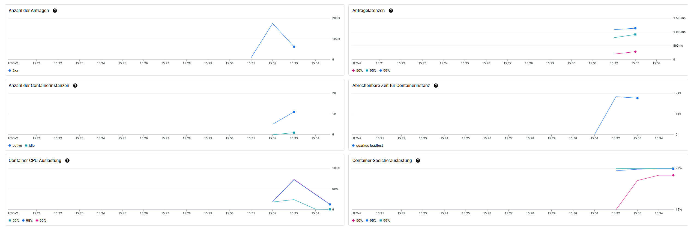

# quarkus-loadtest

This project aims to help with load-testing quarkus-native vs. standard quarkus in cloud environments. The project consists of one endpoint for calculating Prime numbers.
The corresponding github repository for Spring Boot is located here: <https://github.com/skleinhaus/SpringNativeBenchmark>

## Compiling to docker images

Create and run as native container:

```bash
./mvnw package -Dnative
docker build -f src/main/docker/Dockerfile.native -t quarkus/quarkus-loadtest .
docker run -i --rm -p 8080:8080 quarkus/quarkus-loadtest
```

Create and run as non-native container:

```bash
./mvnw package
docker build -f src/main/docker/Dockerfile.jvm -t quarkus/quarkus-loadtest-jvm .
docker run -i --rm -p 8081:8080 quarkus/quarkus-loadtest-jvm
```

## Push to gcloud artifact registry

The gcloud cli is already installed within the devcontainer.

```bash
gcloud auth login
gcloud auth configure-docker europe-west3-docker.pkg.dev
docker tag quarkus/quarkus-loadtest europe-west3-docker.pkg.dev/<project>/quarkus-loadtest/quarkus-loadtest
docker push europe-west3-docker.pkg.dev/<project>/quarkus-loadtest/quarkus-loadtest
docker tag quarkus/quarkus-loadtest-jvm europe-west3-docker.pkg.dev/<project>/quarkus-loadtest/quarkus-loadtest-jvm
docker push europe-west3-docker.pkg.dev/<project>/quarkus-loadtest/quarkus-loadtest-jvm
```

## Deploy to cloud run, then access the automatically published url

Deploy to Cloud Run. To access the url, you need to send an access token as Bearer Token.

Getting the bearer token:

```bash
gcloud auth login
gcloud auth print-identity-token
```

## Execute the load test

Once started, access the prime-calculation endpoint and choose a startNumber and count (how many prime numbers to calculate).
If you don't set the query parameters, the default is used.

```bash
# native application
curl http://localhost:8080/prime-calculation?startNumber=1000000000000&count=1
# non-native application
curl http://localhost:8081/prime-calculation?startNumber=1000000000000&count=1
```

## Results from local testing

### Native quarkus application

* The build takes a lot longer (2 minutes w/o downloading dependencies), utilizing ~14 GB RAM and 8 CPU Cores, image size: 148 MB
* The application starts in 0.014 seconds
* The call using default parameters takes 2.203 seconds
* The container uses 15,88 MB RAM

### Non-native quarkus application

* The build is faster (6.2 seconds w/o downloading dependencies), image size: 475 MB
* The application starts in 0.914 seconds
* The call using default parameters takes 3.518 seconds
* The container uses 132,7 MB RAM

## Results from testing with Google Cloud Run

### Native quarkus application

Tested with Parameters: ?startNumber=1000000000000&count=1




```bash
/home/k6 # k6 run /scripts/script_quarkus_native.js

          /\      |‾‾| /‾‾/   /‾‾/   
     /\  /  \     |  |/  /   /  /    
    /  \/    \    |     (   /   ‾‾\  
   /          \   |  |\  \ |  (‾)  | 
  / __________ \  |__| \__\ \_____/ .io

     execution: local
        script: /scripts/script_quarkus_native.js
        output: InfluxDBv1 (http://influxdb:8086)

     scenarios: (100.00%) 1 scenario, 500 max VUs, 1m50s max duration (incl. graceful stop):
              * default: Up to 500 looping VUs for 1m20s over 5 stages (gracefulRampDown: 30s, gracefulStop: 30s)


     ✓ status is 200

     checks.........................: 100.00% ✓ 14812     ✗ 0    
     data_received..................: 5.6 MB  70 kB/s
     data_sent......................: 1.8 MB  22 kB/s
     http_req_blocked...............: avg=1.53ms   min=94ns       med=285ns    max=322.35ms p(90)=586ns    p(95)=1.29µs  
     http_req_connecting............: avg=654.43µs min=0s         med=0s       max=100.02ms p(90)=0s       p(95)=0s      
     http_req_duration..............: avg=571.4ms  min=29.1ms     med=509.4ms  max=3.27s    p(90)=1.16s    p(95)=1.34s   
       { expected_response:true }...: avg=571.4ms  min=29.1ms     med=509.4ms  max=3.27s    p(90)=1.16s    p(95)=1.34s   
     http_req_failed................: 0.00%   ✓ 0         ✗ 14812
     http_req_receiving.............: avg=324.09µs min=-1164399ns med=81.5µs   max=30.25ms  p(90)=609.28µs p(95)=1.21ms  
     http_req_sending...............: avg=79.22µs  min=15.04µs    med=55.07µs  max=9.6ms    p(90)=134.98µs p(95)=189.85µs
     http_req_tls_handshaking.......: avg=870.66µs min=0s         med=0s       max=287.58ms p(90)=0s       p(95)=0s      
     http_req_waiting...............: avg=571ms    min=29.01ms    med=508.96ms max=3.27s    p(90)=1.16s    p(95)=1.34s   
     http_reqs......................: 14812   185.06599/s
     iteration_duration.............: avg=873.79ms min=329.69ms   med=811.56ms max=3.57s    p(90)=1.46s    p(95)=1.65s   
     iterations.....................: 14812   185.06599/s
     vus............................: 2       min=2       max=499
     vus_max........................: 500     min=500     max=500


running (1m20.0s), 000/500 VUs, 14812 complete and 0 interrupted iterations
default ✓ [======================================] 000/500 VUs  1m20s
```

### Non-native quarkus application

Tested with Parameters: ?startNumber=1000000000000&count=1


```bash
/home/k6 # k6 run /scripts/script_quarkus.js

          /\      |‾‾| /‾‾/   /‾‾/   
     /\  /  \     |  |/  /   /  /    
    /  \/    \    |     (   /   ‾‾\  
   /          \   |  |\  \ |  (‾)  | 
  / __________ \  |__| \__\ \_____/ .io

     execution: local
        script: /scripts/script_quarkus.js
        output: InfluxDBv1 (http://influxdb:8086)

     scenarios: (100.00%) 1 scenario, 500 max VUs, 1m50s max duration (incl. graceful stop):
              * default: Up to 500 looping VUs for 1m20s over 5 stages (gracefulRampDown: 30s, gracefulStop: 30s)


     ✓ status is 200

     checks.........................: 100.00% ✓ 8257       ✗ 0    
     data_received..................: 4.3 MB  54 kB/s
     data_sent......................: 1.3 MB  16 kB/s
     http_req_blocked...............: avg=2.85ms   min=92ns     med=296ns   max=303.31ms p(90)=878ns    p(95)=37.03ms 
     http_req_connecting............: avg=1.19ms   min=0s       med=0s      max=115.37ms p(90)=0s       p(95)=14.72ms 
     http_req_duration..............: avg=1.3s     min=34.69ms  med=1.1s    max=7.57s    p(90)=2.5s     p(95)=3.6s    
       { expected_response:true }...: avg=1.3s     min=34.69ms  med=1.1s    max=7.57s    p(90)=2.5s     p(95)=3.6s    
     http_req_failed................: 0.00%   ✓ 0          ✗ 8257 
     http_req_receiving.............: avg=166.91µs min=14.85µs  med=82.06µs max=27.1ms   p(90)=196.74µs p(95)=439.33µs
     http_req_sending...............: avg=94.3µs   min=13.35µs  med=65.6µs  max=15.06ms  p(90)=156.37µs p(95)=215.55µs
     http_req_tls_handshaking.......: avg=1.64ms   min=0s       med=0s      max=283.7ms  p(90)=0s       p(95)=21.6ms  
     http_req_waiting...............: avg=1.3s     min=34.54ms  med=1.1s    max=7.57s    p(90)=2.5s     p(95)=3.6s    
     http_reqs......................: 8257    102.819432/s
     iteration_duration.............: avg=1.6s     min=335.14ms med=1.4s    max=7.87s    p(90)=2.81s    p(95)=3.91s   
     iterations.....................: 8257    102.819432/s
     vus............................: 1       min=1        max=499
     vus_max........................: 500     min=500      max=500


running (1m20.3s), 000/500 VUs, 8257 complete and 0 interrupted iterations
default ✓ [======================================] 000/500 VUs  1m20s
```

## Running the application in dev mode

You can run your application in dev mode that enables live coding using:
```shell script
./mvnw compile quarkus:dev
```

> **_NOTE:_**  Quarkus now ships with a Dev UI, which is available in dev mode only at http://localhost:8080/q/dev/.
